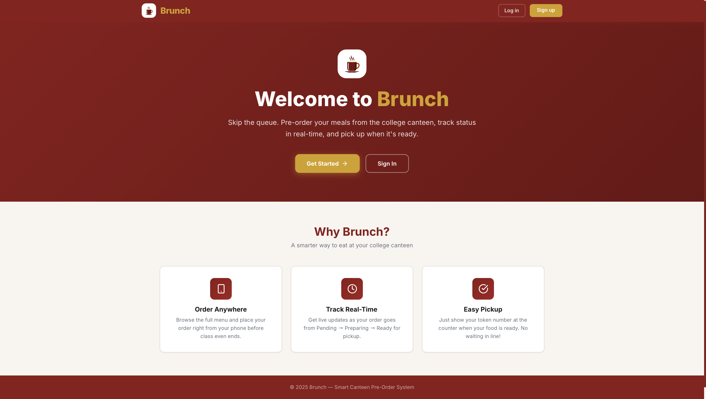
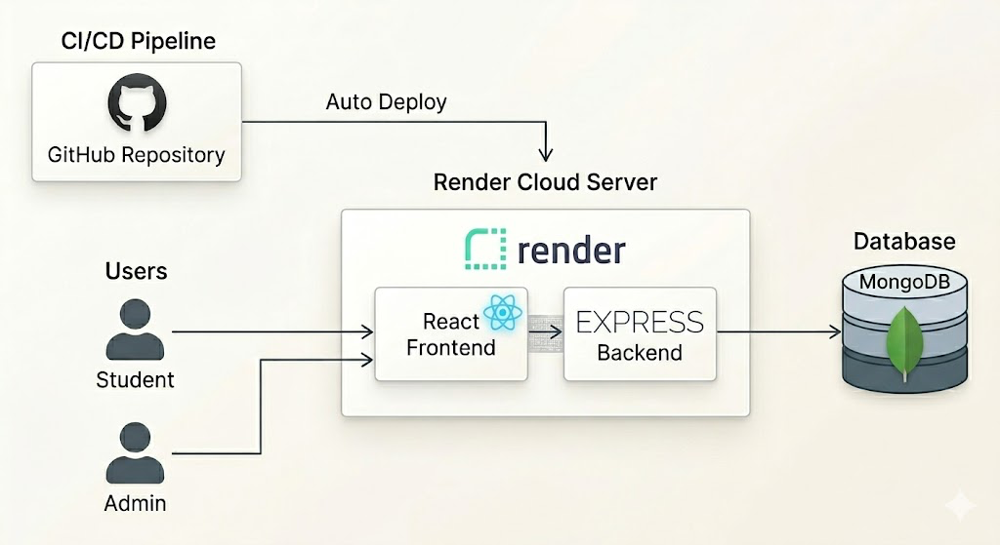
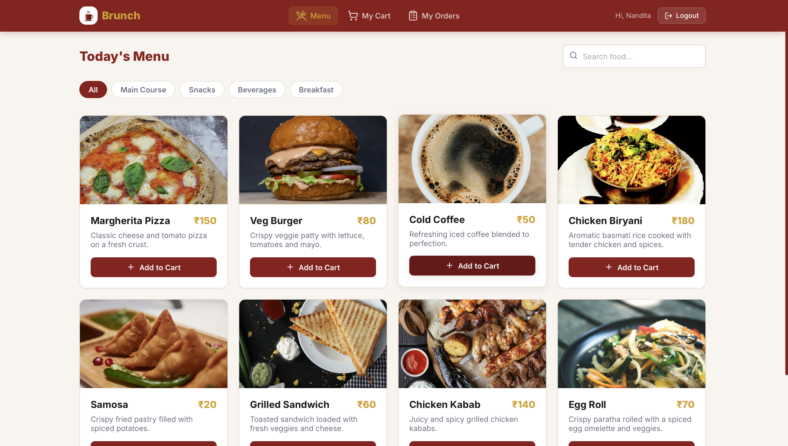

<div align="center">
  
  <h1>Brunch</h1>
  <p><strong>A Modern, Smart Canteen Pre-Order System built for Universities</strong></p>
</div>

<br />



## Overview

**Brunch** is a full-stack, responsive web application that eliminates the hassle of long queues in college canteens. Built with a sleek, premium, mobile-first design (featuring a signature Maroon and Gold UI), it empowers students to order food directly from their phones during lectures, track the live status of their order, and pick it up exactly when it's ready. 

Admins receive a dedicated, real-time dashboard to manage orders, update statuses, and maintain the live menu.

---

## Architecture



Brunch is designed as a **Monolithic Web Service** for seamless, rapid deployment (optimized for platforms like Render). 

- **Frontend:** React (Vite)
- **Backend:** Node.js, Express.js (Serving REST APIs and compiled React static files)
- **Database:** In-memory MongoDB (using MongoMemoryServer for rapid hackathon/demo deployments)

---

## Key Features

### For Students
* **Mobile-First Experience:** A beautiful, App-like interface with a bottom navigation bar.
* **Live Menu:** Browse categories and search for your favorite meals.
* **Cart & Pre-Order:** Add items to cart and place orders instantly to generate a live tracking token.
* **Real-time Tracking:** Watch your order move from `Pending` -> `Preparing` -> `Ready`!



### For Admins
* **Live Operations Dashboard:** See total revenue, active orders, and completed orders at a glance.
* **Order Queue Management:** One-click buttons to transition orders through their lifecycle and notify students.
* **Menu Management:** Fully functional CMS to Add, Edit, or Delete menu items and toggle their availability.

---

## Tech Stack

* **Frontend:** React, Vite, React Router, Axios, Vanilla CSS (Custom Design System), Lucide React Icons
* **Backend:** Node.js, Express.js
* **Database:** MongoDB (Mongoose ORM)
* **Auth:** JSON Web Tokens (JWT), bcryptjs
* **Deployment:** Render (Single Monolithic Web Service)

---

## Quick Start (Local Development)

### Prerequisites
- Node.js (v18+)

### 1. Install & Build
Because Brunch is optimized for a monolithic deployment, you build the frontend first, and then run the backend which serves the UI!

```bash
# Install frontend dependencies and build the UI
cd client
npm install
npm run build

# Install backend dependencies
cd ../server
npm install
```

### 2. Seed the Database
Since the app uses an in-memory database for demonstrations, you must seed it with the default menu and admin user before starting:

```bash
npm run seed
```

**Default Admin Credentials:**
- **Email:** puneeth@gmail.com
- **Password:** 12345

### 3. Run the App
```bash
npm start
```
*The app will automatically run on http://localhost:5001. The backend REST API and the React frontend are both served from this single port!*

---

## Design System
The UI was meticulously crafted from scratch using Vanilla CSS to avoid heavy framework overhead, ensuring lightning-fast load times. It uses a bespoke palette:
- **Primary:** RUAS Maroon (#8B1A1A)
- **Accent:** Royal Gold (#D4A017)
- **Surfaces:** Clean White (#FFFFFF) & Soft Cream (#F9F5F0)
